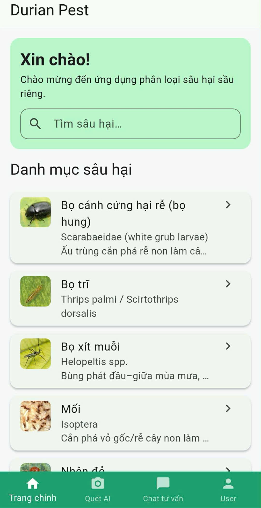
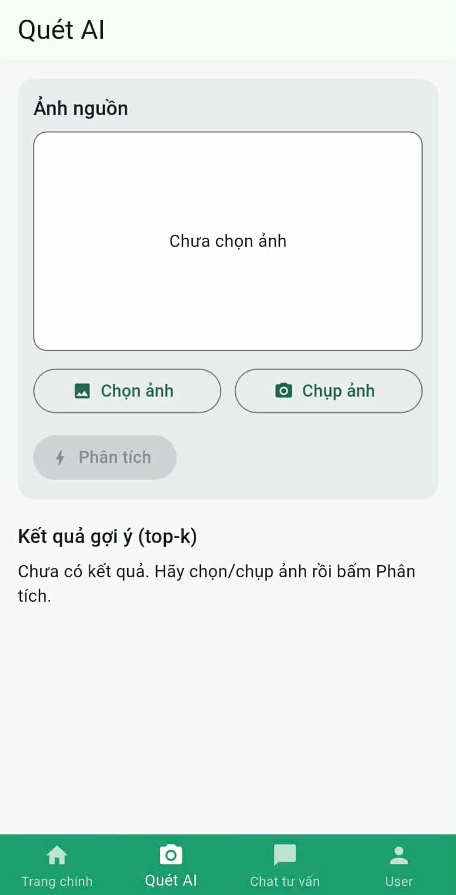
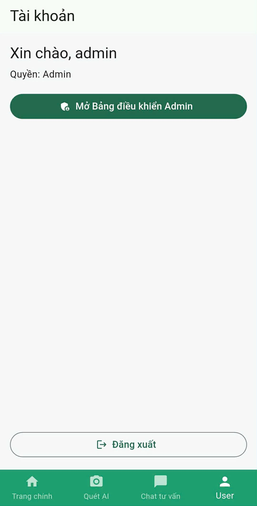
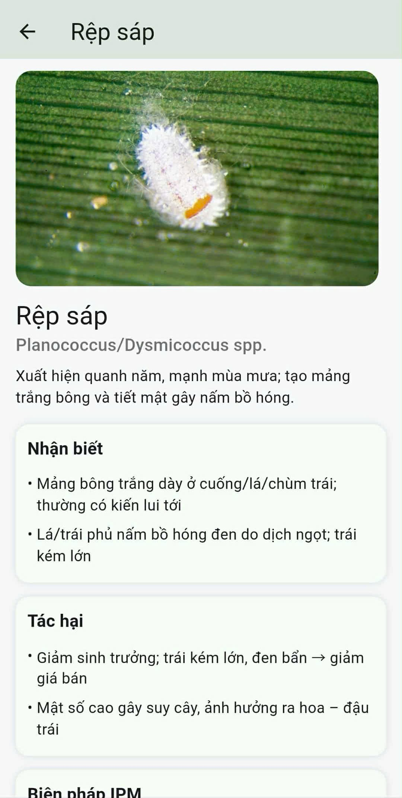
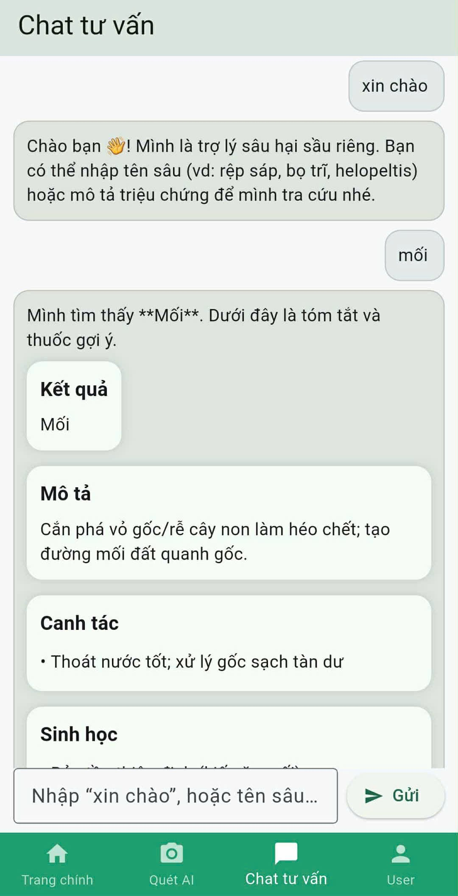
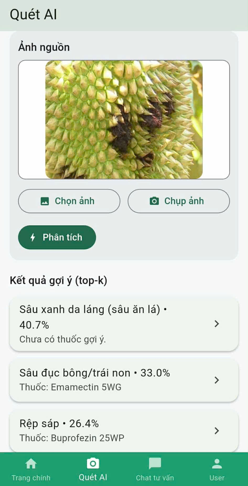
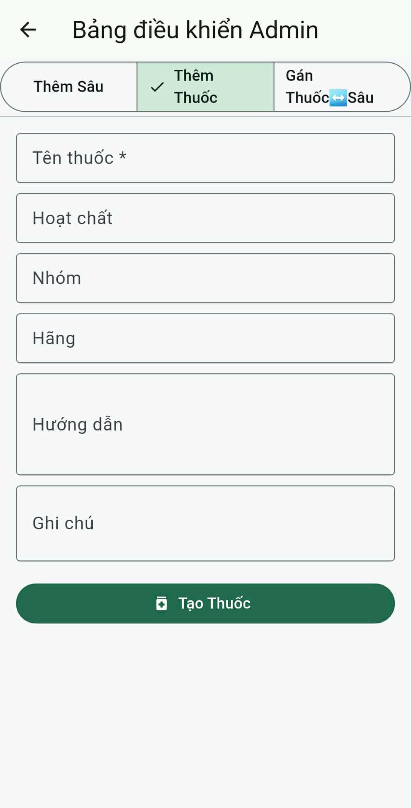
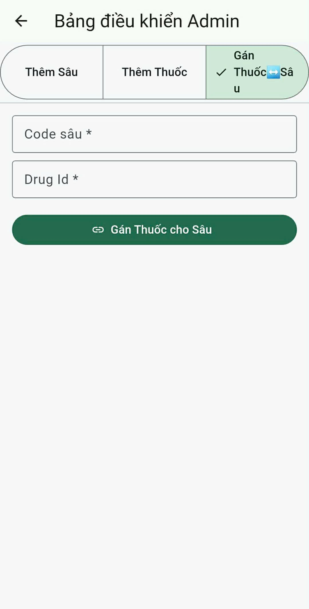

# Ứng dụng Phân loại Sâu hại trên Cây Sầu Riêng

Dự án này xây dựng một hệ thống hoàn chỉnh bao gồm **Flutter (Mobile)**, **FastAPI (Python)** và **MS SQL Server** để nhận diện, tra cứu thông tin và đề xuất biện pháp xử lý cho các loại sâu hại phổ biến trên cây sầu riêng.

Ứng dụng cho phép người dùng chụp ảnh hoặc tải ảnh sâu bệnh lên. Ảnh sẽ được gửi đến backend để phân tích bằng một cơ chế *hybrid* (kết hợp so khớp ảnh tĩnh và mô hình CNN), sau đó trả về thông tin chi tiết của sâu, tác hại và các loại thuốc đặc trị.

---

## Ảnh chụp màn hình ứng dụng

|  |
|  |
|  |
|  |
|  |
|  |
|  |
|  |
|  |

---

## 1.  Chức năng chính

* **Danh mục sâu hại**: Hiển thị toàn bộ các loại sâu được quản lý trong cơ sở dữ liệu (`dbo.Pests`).
* **Chi tiết sâu hại**: Cung cấp thông tin đầy đủ bao gồm mô tả, tên khoa học, đặc điểm nhận biết, tác hại và các biện pháp phòng trừ (IPM).
* **Thư viện ảnh**: Hiển thị các hình ảnh trực quan của sâu (`dbo.PestPhotos`) được lưu trữ tại `/static/`.
* **Gợi ý Thuốc đặc trị**: Đề xuất các loại thuốc phù hợp cho từng loại sâu thông qua bảng quan hệ `dbo.PestDrugs`.
* **Quét AI (Hybrid)** (`/classify`): Tính năng cốt lõi của ứng dụng.
    1. Ưu tiên **so khớp đặc trưng** ảnh đầu vào với các ảnh mẫu trong thư mục `backend/static/`. (Cơ chế này giúp demo nhanh và chính xác với bộ dữ liệu nhỏ mà không cần train lại).
    2. Nếu không khớp, hệ thống sẽ sử dụng **mô hình CNN** (`ml_infer.py`) để phân loại.
    3. Trả về kết quả (top-k), thông tin sâu và các loại thuốc gợi ý.
* **API Admin**: Cung cấp các endpoint (bảo vệ bằng header `X-User`) để quản trị viên có thể thêm/sửa/xóa sâu, ảnh, thuốc và liên kết thuốc với sâu.

---

## 2. Kiến trúc hệ thống

* **Frontend**: Flutter (Dart)
* **Backend**: FastAPI (Python)
* **Database**: Microsoft SQL Server
* **AI/ML**: CNN (TensorFlow/Keras) và Kỹ thuật so khớp ảnh (Image Matching)

```text
durian_pest_app-main/
├─ backend/
│  ├─ app.py           # FastAPI: /pests, /pests/{code}, /classify, /auth, /admin
│  ├─ db/queries.py    # Toàn bộ truy vấn SQL Server (Pests, PestPhotos, Drugs,…)
│  ├─ ml_infer.py      # Nhận diện ảnh: so khớp thư mục static + CNN
│  ├─ static/          # Ảnh mẫu từng sâu: sau_rom.jpg, rep_sap.jpg, ...
│  ├─ models/          # (Tùy chọn) Chứa model .h5, labels.json
│  └─ requirements.txt # Các thư viện Python
├─ lib/                   # Mã nguồn ứng dụng Flutter
│  ├─ models/            # (Lớp đối tượng, vd: pest.dart)
│  │  └─ pest.dart
│  ├─ screens/           # (Các màn hình chính của ứng dụng)
│  │  ├─ home_screen.dart
│  │  ├─ detect_screen.dart
│  │  ├─ pest_detail_screen.dart
│  │  ├─ admin_panel.dart
│  │  └─ ... (và các màn hình khác)
│  ├─ services/          # (Xử lý logic, gọi API)
│  │  ├─ api_service.dart
│  │  ├─ auth_service.dart
│  │  └─ admin_service.dart
│  ├─ theme/             # (Chủ đề, màu sắc, font)
│  │  └─ app_theme.dart
│  ├─ widgets/           # (Các thành phần UI tái sử dụng)
│  │  ├─ pest_card.dart
│  │  └─ section_block.dart
│  ├─ app_router.dart    # (Quản lý điều hướng - routing)
│  └─ main.dart          # (Điểm khởi chạy ứng dụng)
├─ SauRiengDb.bak       # File backup cơ sở dữ liệu
└─ README.md            # File thông tin dự án (chính là file này)
```

---

## 3. Cài đặt và Chạy dự án

Để chạy dự án, bạn cần thiết lập 3 thành phần: Database, Backend, và Frontend.

### 3.1. Cơ sở dữ liệu (SQL Server)

1. Mở SQL Server Management Studio (SSMS).
2. Khôi phục (Restore) cơ sở dữ liệu từ file `SauRiengDb.bak` có sẵn trong repo.
3. Cập nhật chuỗi kết nối (connection string) trong file `backend/db/queries.py` để trỏ đúng đến server và database của bạn.
4. **(Quan trọng)**: Chạy script SQL dưới đây để thêm ảnh mặc định cho từng loại sâu theo `PestId` đã có sẵn trong CSDL (từ 1 đến 16).

    ```sql
    -- Thêm ảnh mặc định cho từng sâu theo Id hiện có
    
    INSERT INTO dbo.PestPhotos (PestId, Url) VALUES (1,  '/static/bo_xit_muoi.jpg');        -- helopeltis  (Bọ xít muỗi)
    INSERT INTO dbo.PestPhotos (PestId, Url) VALUES (2,  '/static/rep_sap.jpg');            -- mealybug    (Rệp sáp)
    INSERT INTO dbo.PestPhotos (PestId, Url) VALUES (3,  '/static/bo_tri.jpg');            -- thrips      (Bọ trĩ)
    INSERT INTO dbo.PestPhotos (PestId, Url) VALUES (4,  '/static/ruoi_duc_qua.jpg');      -- bactrocera  (Ruồi đục quả)
    INSERT INTO dbo.PestPhotos (PestId, Url) VALUES (5,  '/static/nhen_do.jpg');            -- tetranychus (Nhện đỏ)
    INSERT INTO dbo.PestPhotos (PestId, Url) VALUES (6,  '/static/sau_duc_than_canh.jpg');  -- stem_borer  (Sâu đục thân/cành)
    INSERT INTO dbo.PestPhotos (PestId, Url) VALUES (7,  '/static/sau_duc_bong.jpg');       -- conogethes  (Sâu đục bông/trái non)
    INSERT INTO dbo.PestPhotos (PestId, Url) VALUES (8,  '/static/ray_mem.jpg');            -- aphid       (Rầy mềm)
    INSERT INTO dbo.PestPhotos (PestId, Url) VALUES (9,  '/static/rep_vay_xanh.jpg');       -- green_scale (Rệp vảy xanh)
    INSERT INTO dbo.PestPhotos (PestId, Url) VALUES (10, '/static/rep_sap_re.jpg');         -- root_mealy  (Rệp sáp rễ)
    INSERT INTO dbo.PestPhotos (PestId, Url) VALUES (11, '/static/sau_xanh_da_lang.jpg');   -- spodoptera  (Sâu xanh da láng)
    INSERT INTO dbo.PestPhotos (PestId, Url) VALUES (12, '/static/sau_rom.jpg');            -- bagworm     (Sâu róm/túi)
    INSERT INTO dbo.PestPhotos (PestId, Url) VALUES (13, '/static/bo_hung.jpg');            -- white_grub  (Bọ cánh cứng hại rễ)
    INSERT INTO dbo.PestPhotos (PestId, Url) VALUES (14, '/static/oc_sen_oc_buou.jpg');     -- snail       (Ốc sên/ốc bươu)
    INSERT INTO dbo.PestPhotos (PestId, Url) VALUES (15, '/static/moi.jpg');                -- termite     (Mối)
    INSERT INTO dbo.PestPhotos (PestId, Url) VALUES (16, '/static/sau_duc_la.jpg');         -- leaf_miner  (Sâu đục lá);
    ```

### 3.2. Backend (FastAPI)

Yêu cầu: Python 3.8+ và pip.

```powershell
# 1. Di chuyển vào thư mục backend
cd backend

# 2. Tạo môi trường ảo (khuyến nghị)
python -m venv .venv

# 3. Kích hoạt môi trường ảo
.\.venv\Scripts\activate

# 4. Cài đặt các thư viện Python cần thiết
# Lệnh này sẽ tự động đọc file requirements.txt
pip install -r requirements.txt

# 5. Khởi chạy server
# Server sẽ chạy tại: http://localhost:8000
python -m uvicorn app:app --reload --host 0.0.0.0 --port 8000
```

> **Ghi chú:** File `backend/requirements.txt` đã chứa tất cả các thư viện cần thiết (như `fastapi`, `uvicorn`, `pyodbc`, `tensorflow-cpu`, `pillow`...) để chạy dự án.

### 3.3. Frontend (Flutter)

Yêu cầu: Flutter SDK.

```bash
# 1. Cài đặt các gói phụ thuộc
flutter pub get

# 2. Chạy ứng dụng trên máy ảo hoặc điện thoại thật
# QUAN TRỌNG: Thay 192.168.1.xxx bằng địa chỉ IP LAN của máy tính đang chạy Backend
flutter run --dart-define=API_BASE=[http://192.168.1.xxx:8000](http://192.168.1.xxx:8000)
```

---

## 4.  Tóm tắt API Endpoints

* `GET /pests`: Lấy danh sách tất cả sâu hại.
* `GET /pests/{code}`: Lấy thông tin chi tiết của một loại sâu.
* `GET /pests/{code}/drugs`: Lấy danh sách thuốc gợi ý cho một loại sâu.
* `GET /drugs`: Lấy danh sách tất cả các loại thuốc.
* `POST /classify`: Gửi ảnh (dạng `multipart/form-data`) để phân loại.
* `POST /admin/...`: Các API quản trị (yêu cầu header `X-User: admin`).

---

## 5. Bộ dữ liệu (Dataset)

Bộ dữ liệu ảnh được lưu trực tiếp trong kho mã nguồn tại thư mục:

`/backend/dataset/`

Cấu trúc thư mục theo từng lớp sâu hại (mỗi thư mục = 1 nhãn):

* `/backend/dataset/bo_xit_muoi/`
* `/backend/dataset/rep_sap/`
* `/backend/dataset/bo_tri/`
* `/backend/dataset/ruoi_duc_qua/`
* `/backend/dataset/nhen_do/`
* `/backend/dataset/sau_duc_than_canh/`
* `/backend/dataset/sau_duc_bong_trai_non/`
* `/backend/dataset/ray_mem/`
* `/backend/dataset/rep_vay_xanh/`
* `/backend/dataset/rep_sap_re/`
* `/backend/dataset/sau_xanh_da_lang/`
* `/backend/dataset/sau_rom_bagworm/`
* `/backend/dataset/bo_hung_hai_re/`
* `/backend/dataset/oc_sen_oc_buou/`
* `/backend/dataset/moi/`
* `/backend/dataset/sau_duc_la/`

---

## 6. Ghi chú Đồ án

* **Tên đề tài:** *“Xây dựng ứng dụng di động hỗ trợ phân loại sâu hại trên cây sầu riêng tích hợp cơ sở dữ liệu và thị giác máy tính”*
* **Điểm nhấn của dự án:**
    1. Xây dựng hệ thống **Full-stack** (Flutter + FastAPI + SQL Server).
    2. Kết hợp **AI (CNN)** và **So khớp ảnh cục bộ** (`static/`) để tối ưu demo.
    3. Thiết kế **Cơ sở dữ liệu (SQL Server)** chi tiết, chuẩn hóa (thông tin sâu, tác hại, biện pháp IPM, thuốc đặc trị).
    4. Có **API Admin** cho phép mở rộng, quản lý dữ liệu mà không cần can thiệp vào code.
    5. Ứng dụng **Flutter** đa nền tảng, có thể chạy trên điện thoại thật.

---

## 7. 👨‍💻 Tác giả

* **Họ tên:** Nguyễn Hồ Trường Tam, Đinh Ngọc Minh Khôi
* **Mô tả repo:** Đồ án/Bài tập lớn phát triển ứng dụng nhận diện sâu hại sầu riêng.
